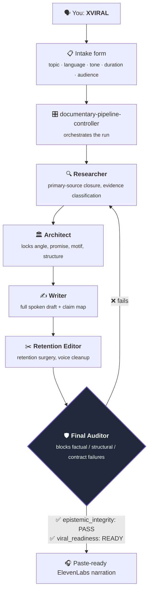

<div align="center">

# 🎬 XVIRAL

### A multi-agent Claude Code plugin that turns a topic into a paste-ready, fact-checked documentary narration.

Say **`XVIRAL`** in a Claude Code session and a pipeline of specialized agents takes your topic from idea to a TTS-ready script — enforcing both source-traceable accuracy and watch-worthy narrative on every release.

[](LICENSE)
[](.claude-plugin/plugin.json)
[](https://claude.com/claude-code)
[](#how-it-works)
[](#project-structure)

[Quickstart](#quickstart) · [How it works](#how-it-works) · [Project structure](#project-structure) · [Requirements](#requirements) · [Caveats](#roadmap--caveats)

</div>

---

> [!NOTE]
> Type **`XVIRAL`** in any Claude Code session, fill in the intake form, and the pipeline runs end to end. Only **topic** and **language** are required — everything else defaults to best judgment.

## What is XVIRAL?

XVIRAL is a [Claude Code](https://claude.com/claude-code) plugin. It takes a topic from idea to a paste-ready [ElevenLabs](https://elevenlabs.io) narration by running it through a pipeline of isolated agents that enforce two things on every release:

- 🔍 **Epistemic Integrity** — every claim is true, sourced, and traceable.
- 🎯 **Narrative Power** — the script earns attention; it's actually worth watching.

No manual stitching of research, writing, and fact-checking across separate prompts — **one pipeline, one accountable output.**

## How it works

Five specialized agents run in sequence, each isolated so context can't leak between stages. Nothing is released until **both** status gates pass:



There's no partial or unaudited output — the script ships only after the auditor clears it.

## Quickstart

```text
XVIRAL
```

1. **Install** the plugin (see [below](#install)).
2. In a Claude Code session, type `XVIRAL`.
3. **Fill in the intake form** Claude returns — topic and language are the only required fields.
4. The pipeline runs end-to-end and hands back a **paste-ready narration script** for ElevenLabs (or any compatible TTS).

## Install

Clone this repo into your Claude Code plugins/skills directory:

```bash
git clone https://github.com/iam7erek/xviral.git
```

Then point your Claude Code plugin manager at the cloned `xviral` folder (or copy it into your skills directory directly) and restart Claude Code. The `xviral` skill and every supporting agent/skill load automatically — no further configuration needed.

> [!TIP]
> The exact directory depends on your Claude Code setup. Drop the folder wherever your installation scans for plugins, then restart so it's picked up.

## Project structure

```text
xviral/
├── .claude-plugin/plugin.json   # Plugin manifest (documentary-studio v1.2.0)
├── agents/                      # 5 sequential pipeline agents
└── skills/                      # 14 skill modules powering each stage
```

| Path | Purpose |
|---|---|
| `.claude-plugin/plugin.json` | Plugin manifest |
| `agents/` | Architect, Researcher, Writer, Retention Editor, Final Auditor |
| `skills/xviral/` | Entry point — presents the intake form |
| `skills/documentary-pipeline-controller/` | Orchestrates the full pipeline |
| `skills/documentary-current-research/` | Current-events research pass |
| `skills/documentary-topic-intelligence/` | Topic scoping & intelligence |
| `skills/psychological-blueprint-architect/` | Narrative angle & structure |
| `skills/cinematic-monologue-writer/` | Spoken-draft writing |
| `skills/concrete-grounding-recording-pass/` | Grounds abstractions in concrete detail |
| `skills/retention-surgery/` | Pacing & retention editing |
| `skills/noir-voice-anti-generic-style/` | Style pass — kills generic AI voice |
| `skills/evidence-anti-hallucination/` | Claim verification against sources |
| `skills/elevenlabs-ready-voice-script/` | Final TTS-ready formatting |
| `skills/documentary-short-pack/` | Short-form cutdown packaging |
| `skills/platform-packaging/` | Per-platform packaging (titles, descriptions, etc.) |
| `skills/documentary-final-auditor/` | Final pass/fail gate |

## Requirements

- **[Claude Code](https://claude.com/claude-code)** — the plugin runs inside a Claude Code session.
- **An [ElevenLabs](https://elevenlabs.io) (or compatible TTS) account** — to voice the final script.

## Roadmap & caveats

> [!WARNING]
> Output is LLM-generated. The Final Auditor reduces — but does not eliminate — hallucination risk. **Always review sources before publishing.**

- 🧪 No automated test suite yet — contributions welcome.
- 📌 v1.2 adds adversarial override resistance, deterministic artifact validation, a required `thesis_coherence_map`, and `inference_id` coverage across packaging and shorts.

## Contributing

Issues and PRs are welcome — open one on the [issues page](https://github.com/iam7erek/xviral/issues). For larger changes, open an issue to discuss first.

## License

[MIT](LICENSE) © [**@iam7erek**](https://github.com/iam7erek)

---

<div align="center">
<sub>Built with Claude Code · Say <strong>XVIRAL</strong> to start.</sub>
</div>
